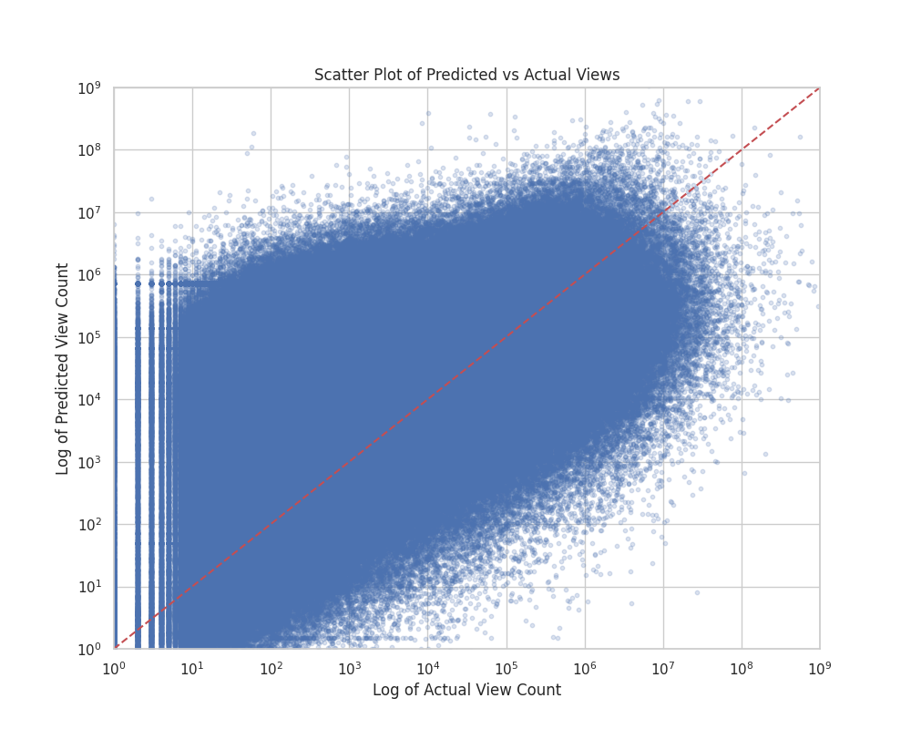

# TitleTransformers

## Repository for a model based in Attention Mechanisms (Transformers), to predict Engagement of YouTube video titles.

## V-1.0:

It is a model based on Transformers that receives a tokenized title and predicts the order of magnitude of views that a YouTube video has. The model is relatively small, with 3 million parameters. To decide on the architecture, I relied on the Keras documentation about NLP. It was trained with a dataset from https://arxiv.org/pdf/2012.10378.pdf, which consists of 79.2 million titles with view labels. I trained it for about 50 epochs on an RTX2080, and the prediction results seemed quite promising to me.

### Metrics:

## V-2.0

### Preprocessing:

-The new model implements the BERT tokenizer instead of fitting a custom one. 

-Using a more efficient dataloader, it removes the necesity of batch loading. 

-It proposes a ReLU-like function to rescale rewards of the model.

$ReLU(x) = slope \cdot (x - center) \cdot (x>center) + \epsilon$

### Model:

-Optimized Input lenght to 40 tokens.

-The model has 30 million parameters, because of the BERT embedding layer.

-The transformer layer will use 12 heads insted of 8.

-Changed Pooling Layer from Max to Average.

